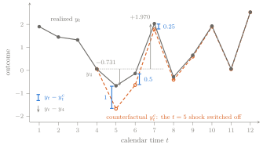
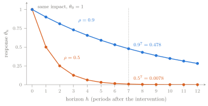
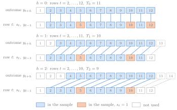
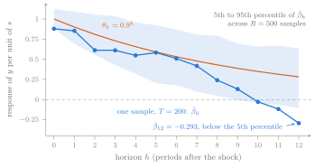
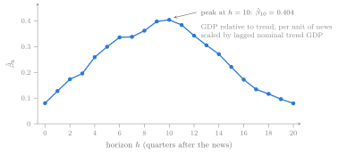

## Korea, 1950

<!-- Built last from the stable chapter (_body.qmd, exercises.qmd), following
     the slides arc in section 9 of the Lecture 01 brief. Arc items 5 and 6
     ("the model is a regression", "why y_{t-1}") share one slide so that the
     lab, the exercise workflow, and the handoff each keep their own slide
     within fifteen slides. Figures carry pixel widths because reveal's
     auto-stretch shrinks an image beside hidden fragments. -->

- 1950Q3: military news worth 0.600 of a year's trend GDP
- GDP: 2.75 percent below trend in 1950Q2, 5.12 percent above it in 1953Q1,
  a rise of 7.87 points
- The same quarters: tax increases, the 1951 Treasury–Fed Accord, wage and
  price controls

::: {.fragment}
One realized path, with everything mixed in. We want what happened *because
of* the news: a path nobody observed.
:::

::: aside
Data: Ramey (2011); Ramey and Zubairy (2018). Trend GDP is their potential GDP,
a sixth-degree polynomial trend in real GDP.
:::

## Two paths, one gap

{fig-alt="Two twelve-period outcome paths coincide through period 4, separate by exactly one unit at period 5, and the gap then halves each period, while the realized path swings well above and below its period-4 value." width="620" fig-align="center"}

::: {.fragment}
The gap $y_t-y^{c}_t$: 1, 0.5, 0.25 at $t=5,6,7$. The change since $y_4$:
$-0.731$, $-0.197$, $1.970$.
:::

## Two clocks {.smaller}

Calendar time $t$ dates the intervention and the regression row. Horizon $h$
counts the periods after it.

| Intervention switched off | Dates of the gaps | Horizons | Gaps |
|---|---|---|---|
| at $t=5$ | 5, 6, 7 | 0, 1, 2 | 1, 0.5, 0.25 |
| at $t=10$ | 10, 11, 12 | 0, 1, 2 | 1, 0.5, 0.25 |

::: {.fragment}
Same gaps at different dates: the rule treats an intervention the same way
whenever it arrives, so the response depends on $h$, not on $t$. The
impulse-response function is $h\mapsto\theta_h$.
:::

::: {.fragment}
The 7.87-point rise was a calendar-time fact about 1950–1953. The policymaker
asked a horizon question, and one regression will estimate one point on its
curve.
:::

## Persistence sets the shape

Iterate $y_t=\rho\,y_{t-1}+\theta_0 s_t+v_t$ forward: $\theta_h=\theta_0\rho^{h}$.

{fig-alt="Two geometric decay curves start from the same value of 1 at horizon 0; the curve for rho equal to 0.5 is close to zero by horizon 5, while the curve for rho equal to 0.9 is still near 0.3 at horizon 12." width="600" fig-align="center"}

::: {.fragment}
The intervention sets only the first step; persistence does the rest. An AR(1)
response can only decay.
:::

## The forward equation is a regression

$$
\begin{aligned}
y_{t+h}&=\theta_0\rho^{h}\,s_t+\rho^{h+1}\,y_{t-1}+u_{t,h}\\
u_{t,h}&=\textstyle\sum_{j=0}^{h}\rho^{h-j}v_{t+j}+\theta_0\sum_{j=1}^{h}\rho^{h-j}s_{t+j}
\end{aligned}
$$

$u_{t,h}$ holds only terms dated $t$ or later, and not $s_t$.

::: {.fragment}
Interventions are unpredictable and independent of the disturbances (A2, A3),
so $u_{t,h}$ is uncorrelated with $s_t$ and $y_{t-1}$ and $\beta_h=\theta_h$.
Least squares did none of that work.
:::

::: {.fragment}
One regression per horizon: a local projection. Without $y_{t-1}$, the same
$\beta_h$ but a noisier estimate (sd of $\hat\beta_0$ 0.218, not 0.073).
:::

## Rows by hand

{fig-alt="Three stacked panels for horizons 0, 1, and 2, each showing twelve dated rows; the usable rows start at row 2 in every panel and end at rows 12, 11, and 10, and each usable row is linked to the outcome h periods later." width="630" fig-align="center"}

::: {.fragment}
$T_h=T-h-p$: 11, 10, 9 rows. Slopes 0.617, $-0.983$, $2.050$ against
$\theta_h$ of 1, 0.5, 0.25.
:::

## One episode

With a single intervention row $\tau$:

$$
\hat\beta_h=y_{\tau+h}-\bar y_{\text{others}}
$$

::: {.fragment}
The hand table with only the $t=5$ intervention, at $h=0$:

$$
\hat\beta_0=-1.632=\underbrace{1}_{\theta_0}
+\underbrace{0.5\,y_4+v_5-\bar y_{\text{others}}}_{\text{everything else}\;=\;-2.632}
$$
:::

::: {.fragment}
Korea is one such row. More episodes help only if what else happened is
unrelated to the news.
:::

## One draw against the truth

{fig-alt="Estimated responses from one simulated sample over horizons 0 to 12 lie below the true geometric response at every horizon and fall below zero after horizon 9, while a wide simulated 90 percent band surrounds the true response." width="560" fig-align="center"}

<!-- D32: seed 2 was fixed before any estimate was computed and the draw is
     kept. D2: the band is the stored instructor-build result, R = 500. -->

One $T=200$ sample: all estimates below $\theta_h=0.9^h$.

::: {.fragment}
A caption names the intervention, the units of $s$ and $y$, the horizon
unit, and the counterfactual.
:::

## Inside the residual

$$
\begin{aligned}
u_{t,1}&=\rho\,v_t+v_{t+1}+\theta_0s_{t+1}\\
u_{t+1,1}&=\rho\,v_{t+1}+v_{t+2}+\theta_0s_{t+2}
\end{aligned}
$$

Adjacent rows share $v_{t+1}$: correlation $\rho/(2+\rho^2)$. At horizon $h$,
residuals up to $h$ rows apart are correlated.

::: {.fragment}
Across horizons, $u_{t,h+1}=\rho\,u_{t,h}+v_{t+h+1}+\theta_0s_{t+h+1}$.
:::

<!-- D43: one labeled sentence previews Lecture 5. -->

::: {.fragment}
Lecture 5 shows that inference depends on the autocorrelation of $s_tu_{t,h}$,
which is zero here because $s_t$ is independent of all the other terms and
$y_{t-1}$ is a control.
:::

## First contact: military news and GDP

{fig-alt="Estimated response of GDP relative to trend over horizons 0 to 20 quarters rises from about 0.08 at impact to a peak of about 0.40 at quarter 10 and declines to about 0.08 by quarter 20." width="600" fig-align="center"}

$y_{t+h}$ on $(1,s_t,y_{t-1})$, 1890Q1–2015Q4, $T_h=504-h$.

::: {.fragment}
News worth 1 percent of trend GDP is followed ten quarters later by GDP 0.40
percent of trend GDP above what the regression otherwise predicts.
:::

## What has not yet been argued {.smaller}

<!-- D33, D5: estimates and variation shares as in tbl-l01-news-variation;
     the Ramey-Zubairy workbook itself is fetched by script, never shipped. -->

| Quarter | News, fraction of trend GDP | Share of variation | Cumulative share |
|---|---:|---:|---:|
| 1941Q4 | 0.6919 | 0.2612 | 0.2612 |
| 1950Q3 | 0.6001 | 0.1958 | 0.4570 |
| 1942Q3 | 0.4328 | 0.1009 | 0.5579 |
| 1950Q4 | 0.4022 | 0.0869 | 0.6448 |

Shares of $\sum_t(s_t-\bar s)^2$ in the $h=8$ sample of 496 quarters. Dropping
1950Q3 alone moves $\hat\beta_8$ from 0.362 to 0.434.

::: {.fragment}
Still to argue: **units** (Lecture 2); **controls**, since Ramey and Zubairy's
set lowers $\hat\beta_{10}$ to 0.294 (Lecture 3); **identification** (Lectures
3–4); **uncertainty** (Lectures 5–6); **episode dependence** (Lecture 13).
:::

## The Shock-to-Response Explorer

[Open the Explorer](../../interactives/01-shock-to-response-explorer.qmd);
predict before touching a control.

1. Two paths: switch off the $t=5$ intervention.
2. Rows: move $h$ and watch rows leave the sample.
3. One draw: toggle $y_{t-1}$ and shorten $T$.
4. Military news: drop 1941Q4 or 1950Q3 at $h=8$.

[Practicum 01](../../practica/p01-question-to-projection/index.qmd) reruns these
rows in Stata and reproduces the levels curve of Jordà–Taylor Figure 1a at a
reduced draw count.

## Exercises, hints, and worked solutions

1. Start with the [Lecture 01 exercises](notes.qmd#sec-l01-exercises): six by
   hand, four in Stata, one of them on the military-news data.
2. Open **Hint** only when you need a direction.
3. Compare your work with the **Detailed solution**. Every Stata solution ends
   in assertions you can run.

The [solutions companion](solutions.qmd) also provides a printable PDF with
all 10 hints and solutions expanded.

## Next lecture

- Every regression here used the level $y_{t+h}$, with $y_{t-1}$ on the
  right-hand side.
- The opening's 7.87 points was a change, $y_{t+h}-y_{t-1}$, and a change
  since the date before is not a causal response.

::: {.fragment}
**If we regress $y_{t+h}-y_{t-1}$ instead of $y_{t+h}$, is the answer
different, or the same answer in different clothes?**
:::

::: {.fragment}
Lecture 2: levels, differences, cumulative responses, and units, on the same
military-news data.
:::
